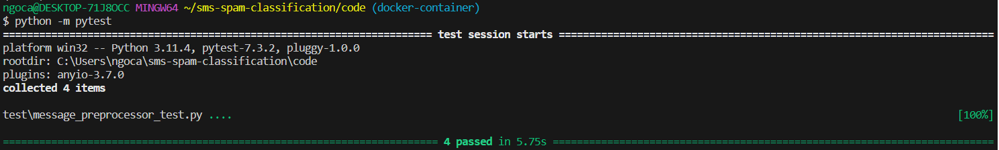
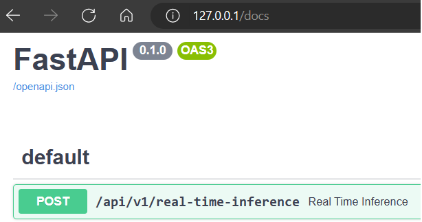
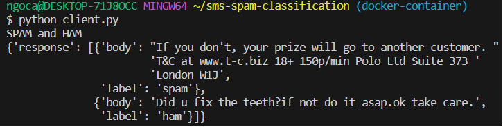

# SMS Spam Classifier
This repository contains the code for building and deploying a SMS spam classifier using Dockerized inference code. The classifier is trained to differentiate between legitimate messages(ham) and spam messages using machine learning techniques.

## Important Files and Directories:
* [Jupyter Notebook](./notebook/solution.ipynb)
* [Model Artifacts](./model/)
* [FastAPI Inference Code](./code/server.py)
* [Dockerfile](./Dockerfile)
* [DockerImage](https://hub.docker.com/repository/docker/carlongo/sms-spam-classifier/general)
* [How to start the application](#installation)

## Features
Utilizes natural language processing techniques to analyze the content of SMS messages.
Uses a trained machine learning model to classify messages as either spam or ham.
Dockerized inference code allows for easy deployment and scalability.
Provides a REST API for interacting with the classifier.

## Requirements
* Docker
* Python 3.11.4 was used in the development
* FastAPI (for the REST API)
* Scikit-learn (to train the machine learning model)
* NLTK (for natural language processing)
* Extensive list in [requirements.txt](./requirements.txt)

## Installation
1. Clone this repository to your local machine:
    ```bash
    git clone https://github.com/carlonngo/sms-spam-classification.git
    ```
2. Change into the cloned directory:
    ```bash
    cd sms-spam-classification
    ```
3. OPTIONAL: Run unit tests. Note: You need pytest module installed here
    ```bash
    cd code
    python -m pytest
    cd .. 
    ```
    
4. Build the Docker image
    ```bash
    docker build -t sms-spam-classifier-image .

    #Alternatively, just pull the image from dockerhub
    docker pull carlongo/sms-spam-classifier:v1.0
    ```
5. Run the Docker container
    ```bash
    docker run -d --name sms-spam-classifier-container -p 80:80 sms-spam-classifier-image

    #Alternatively, run the image pulled from dockerhub
    docker run -p 80:80 carlongo/sms-spam-classifier:v1.0
    ```

## Usage
Once the Docker container is running, you can interact with the SMS spam classifier using the provided REST API.\
You should be able to see a swagger API documentation at: http://127.0.0.1/docs

### API Endpoints
* `POST /real-time-inference`: Classify single/multiple SMS message(s) as spam or ham.
    * Request body (JSON format):
        ```json
        {
            "messages": [
                "string"
            ]
        }
        ```
    * Response body (JSON format):
        ```json
        {
            "response": [
                {
                "body": "string",
                "label": "string"
                }
            ]
        }
        ```
### Example
You can use a tool like cURL or Postman to send HTTP requests to the API endpoints. Here's an example using cURL:
```bash
curl -X 'POST' \
'http://127.0.0.1/api/v1/real-time-inference' \
-H 'accept: application/json' \
-H 'Content-Type: application/json' \
-d '{
    "messages": [
        "Hello!"
    ]
}'
```
This will return the classification of the message as a response:
```json
{
  "response": [
    {
      "body": "Hello!",
      "label": "ham"
    }
  ]
}
```
A sample [client.py](./client.py) is available that can act as client to our server.\
NOTE: you need the **requests** module to run it.
```bash
python code/client.py
```


## Acknowledgments
The machine learning model used in this project was trained using the SMS Spam Collection dataset, which can be found at https://archive.ics.uci.edu/ml/datasets/SMS+Spam+Collection.
